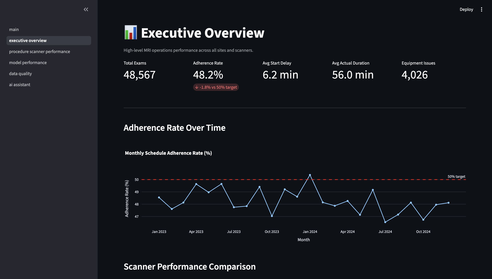
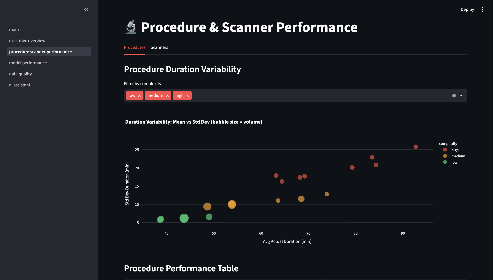
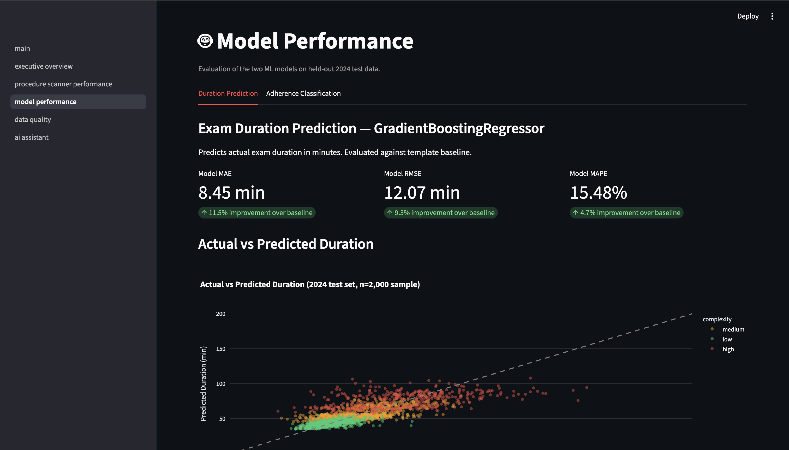
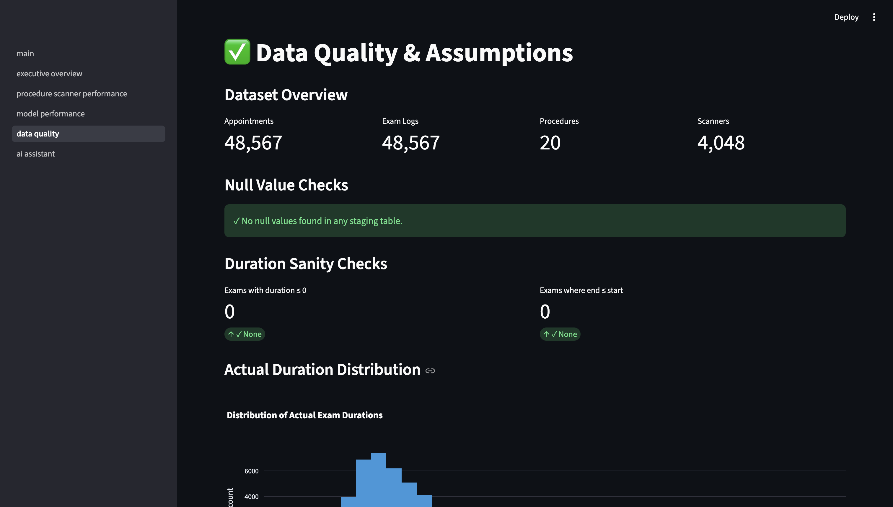
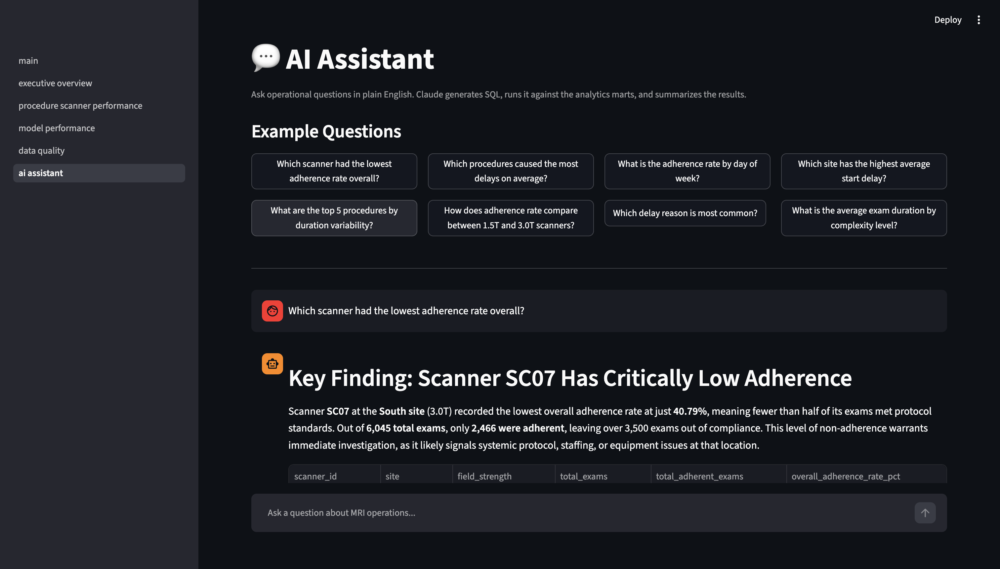

# MRI Operations Intelligence Platform

An end-to-end analytics system for improving MRI scheduling accuracy and operational decision-making — built with Python, SQL, dbt, Streamlit, and machine learning.

**[🚀 Live Demo](https://mri-ops-platform-nipm8kfbsut8astpkkozk4.streamlit.app)**

---

## The Problem

Hospital MRI departments run complex schedules across multiple scanners, procedure types, and patient populations. When exams run long, cascade delays ripple through the rest of the day. Operations managers need to know:

- Which procedures are driving delays?
- Which scanners are underperforming?
- Will this exam finish on time?

This platform answers those questions using a governed analytics layer, two applied ML workflows, and an LLM assistant that lets operations staff ask questions in plain English.

---

## Screenshots

### Executive Overview


### Procedure & Scanner Performance


### Model Performance


### Data Quality & Assumptions


### AI Assistant


---

## Architecture

```
Synthetic Data Generation (Python / Faker)
          │
          ▼
  Raw Tables (DuckDB / Snowflake)
          │
          ▼
  dbt Transformation Layer
  ├── staging/        # clean + rename raw sources
  ├── intermediate/   # joins + business logic
  └── marts/          # purpose-built analytics tables
          │
     ┌────┴────┐
     ▼         ▼
  ML Models   LLM Assistant (Anthropic Claude)
  ├── exam     text-to-SQL over dbt marts
  │   duration
  │   prediction
  └── schedule
      adherence
      classification
          │
          ▼
  Streamlit Application
  ├── Executive Overview
  ├── Procedure & Scanner Performance
  ├── Model Performance
  ├── Data Quality & Assumptions
  └── AI Assistant
```

---

## Project Structure

```
mri_ops_platform/
├── data/
│   └── synthetic/              # generated datasets (gitignored)
├── scripts/
│   └── generate_data.py        # synthetic data generation
├── dbt/
│   ├── models/
│   │   ├── staging/            # stg_appointments, stg_exam_logs, ...
│   │   ├── intermediate/       # int_exam_durations, int_schedule_adherence
│   │   └── marts/              # mart_daily_scanner_performance, ...
│   ├── tests/
│   ├── macros/
│   └── dbt_project.yml
├── ml/
│   ├── notebooks/              # EDA and prototyping
│   ├── scripts/
│   │   ├── train_duration_model.py
│   │   └── train_adherence_model.py
│   ├── artifacts/              # saved model files (gitignored)
│   └── reports/                # evaluation outputs
├── app/
│   ├── main.py
│   └── pages/
│       ├── 01_executive_overview.py
│       ├── 02_procedure_scanner_performance.py
│       ├── 03_model_performance.py
│       ├── 04_data_quality.py
│       └── 05_ai_assistant.py
├── assistant/
│   ├── text_to_sql.py          # LLM -> SQL -> result pipeline
│   └── mart_schema.py          # mart definitions exposed to LLM
├── docs/
│   ├── data_dictionary.md
│   └── architecture.md
├── .env.example
└── requirements.txt
```

---

## Data Model

Synthetic dataset modeled on real MRI operations patterns (distributions informed by scheduling research):

| Table | Description |
|---|---|
| `patients` | Age group, demographics (no PII) |
| `appointments` | Scheduled start/end, procedure, scanner, patient |
| `procedures` | Procedure code, name, contrast required, template duration |
| `scanners` | Scanner ID, site, field strength, status |
| `actual_exam_logs` | Actual start/end, delay reason, technologist |
| `staffing` | Shift schedule by site and role |
| `calendar_events` | Holidays, maintenance windows |

---

## dbt Models

| Layer | Model | Description |
|---|---|---|
| Staging | `stg_appointments` | Typed, renamed appointments |
| Staging | `stg_exam_logs` | Typed, renamed exam records |
| Staging | `stg_procedures` | Procedure reference data |
| Staging | `stg_scanners` | Scanner reference data |
| Intermediate | `int_exam_durations` | Scheduled vs actual duration per exam |
| Intermediate | `int_schedule_adherence` | Adherence flag (finish within ±10 min) |
| Mart | `mart_daily_scanner_performance` | Daily rollup: utilization, delay, adherence per scanner |
| Mart | `mart_procedure_variability` | Procedure-level duration stats: mean, std, p90 |
| Mart | `mart_ml_features` | Feature table for model training and inference |

---

## ML Models

### Exam Duration Prediction
Predicts actual exam duration in minutes.
- **Features**: procedure type, scanner, time of day, day of week, contrast, patient age group
- **Model**: XGBoost regressor
- **Evaluation**: MAE, RMSE, MAPE vs template baseline

### Schedule Adherence Classification
Predicts whether an exam will finish within ±10 minutes of scheduled end.
- **Model**: XGBoost classifier
- **Evaluation**: AUC-ROC, precision, recall, F1
- **Use**: risk flagging in the Streamlit app

---

## LLM Assistant

Natural language → SQL → result → plain-English summary.

```
"Which procedures caused the most delays last month?"
  │
  ▼
Claude generates SQL against mart_procedure_variability
  │
  ▼
SQL executes against DuckDB / Snowflake
  │
  ▼
Result table + plain-English summary
Generated SQL shown for transparency
```

Powered by Anthropic Claude (claude-sonnet-4-6).

---

## Tech Stack

| Layer | Tools |
|---|---|
| Data generation | Python, Faker, NumPy |
| Warehouse | DuckDB (local) → Snowflake (production) |
| Transformation | dbt-core, dbt-duckdb / dbt-snowflake |
| ML | scikit-learn, GradientBoosting, SHAP |
| App | Streamlit, Plotly |
| LLM | Anthropic Claude API |

---

## Setup

```bash
git clone https://github.com/lunlii/mri-ops-platform.git
cd mri-ops-platform
pip install -r requirements.txt
cp .env.example .env  # add your API keys

python scripts/generate_data.py

cd dbt && dbt run && dbt test

python ml/scripts/train_duration_model.py
python ml/scripts/train_adherence_model.py

streamlit run app/main.py
```

---

## About

Built to demonstrate end-to-end data engineering, analytics engineering, and applied ML skills in a healthcare operations context. Synthetic data distributions are informed by MRI scheduling research conducted as part of dissertation work in Industrial & Systems Engineering at the University of Washington.
